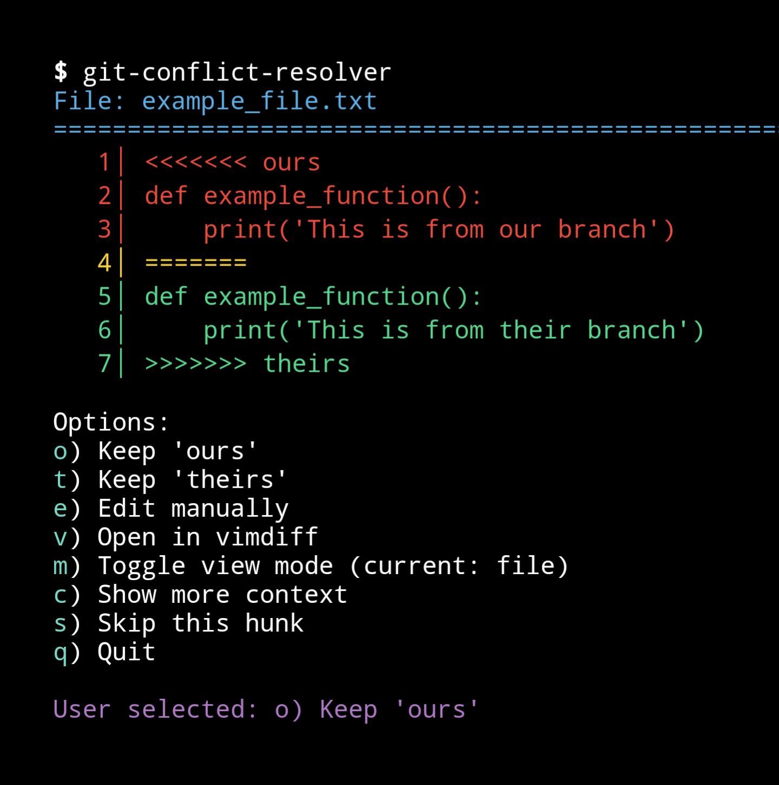

# git-simple-merge
A simple tool to quickly resolve git merge conflicts.

A `git add --patch` but for conflict resolution.



This tool provides an interactive interface to view and resolve conflicts either by viewing entire files or individual conflict hunks. It offers options to keep changes from either branch, manually edit conflicts, or use external tools like `vimdiff`.

`vimdiff` and tools in IDEs are great when you have a complex merge to resolve. But sometimes you can look at a conflict and quickly decide which change to accept without needing open an editor.

`git-simple-merge` lets you do just that. Either triggered by `git mergetool` or ran by itself.

Note: the tool is considered **experimental** and could break your git repo.

## Features

- **Interactive Conflict Resolution**: Choose to keep 'ours', 'theirs', edit manually, or use `vimdiff`.
- **View Modes**: Toggle between viewing entire files or individual conflict hunks.
- **Context Lines**: Display surrounding lines for better understanding of conflicts.
- **Automatic Staging**: Automatically stages resolved files after manual edits.
- **Color-Coded Output**: Enhanced readability with color-coded conflict markers using `colorama`.

## Table of Contents

- [Installation](#installation)
- [Usage](#usage)
- [Configuration](#configuration)
- [Options](#options)
- [Contributing](#contributing)
- [License](#license)

## Installation

1. **Clone the Repository**

   ```bash
   git clone https://github.com/dave1010/git-simple-merge.git
   cd git-simple-merge
   ```

2. **Create a Virtual Environment (Optional but Recommended)**

   ```bash
   python3 -m venv venv
   source venv/bin/activate
   ```

3. **Install Dependencies**

   ```bash
   pip install -r requirements.txt
   ```

4. **Make the Script Executable**

   ```bash
   chmod +x git-simple-merge.py
   ```

5. **Add to PATH (Optional)**

   To use the script from anywhere, you can add its directory to your `PATH` or move the script to a directory that's already in `PATH`, such as `/usr/local/bin`.

   ```bash
   sudo mv git-simple-merge.py /usr/local/bin/git-simple-merge
   ```

## Usage

Navigate to your Git repository and run the script:

```bash
./git-simple-merge.py
```

Alternatively, if added to your `PATH`:

```bash
git-simple-merge
```

### As a Git Mergetool

You can configure this script to be used as a Git mergetool:

1. **Configure Git to Use the Script as a Mergetool**

   ```bash
   git config --global merge.tool git-simple-merge
   git config --global mergetool.git-simple-merge.cmd 'git-conflict-resolver'
   git config --global mergetool.git-simple-merge.trustExitCode true
   ```

2. **Set to Prompt Before Launching the Tool**

   ```bash
   git config --global mergetool.prompt false
   ```

3. **Use the Mergetool**

   ```bash
   git mergetool
   ```

## Configuration

- **Editor**: The script uses the `EDITOR` environment variable for manual edits. If not set, it defaults to `nano`.

  ```bash
  export EDITOR=vim
  ```

- **Context Lines**: By default, 3 lines of context are shown around conflicts. You can increase this up to 10 lines using the provided options during conflict resolution.

## Options

During conflict resolution, you will be presented with the following options:

- `o`: **Keep 'ours'** - Retain your current branch's changes.
- `t`: **Keep 'theirs'** - Accept changes from the incoming branch.
- `e`: **Edit manually** - Open the file in your default editor for manual conflict resolution.
- `v`: **Open in vimdiff** - Launch `vimdiff` to visually compare and merge changes.
- `m`: **Toggle view mode** - Switch between file view and hunk view.
- `c`: **Show more context** - Increase the number of context lines around conflicts.
- `s`: **Skip this hunk** - Move to the next conflict without making changes.
- `q`: **Quit** - Exit the script.

## Example Workflow

1. **Identify Conflicted Files**

   After a merge conflict occurs, run the script to identify and process conflicted files.

   ```bash
   git-simple-merge
   ```

2. **Resolve Conflicts**

   For each conflicted file, choose how to resolve each conflict based on the provided options.

3. **Finalize Merge**

   Once all conflicts are resolved, commit the merge as usual.

   ```bash
   git commit -m "Resolved merge conflicts using the amazing git-simple-merge tool."
   ```

## Contributing

Contributions are welcome! Please open an issue or submit a pull request for any enhancements or bug fixes.

## License

This project is licensed under the MIT License. See the [LICENSE](LICENSE) file for details.
